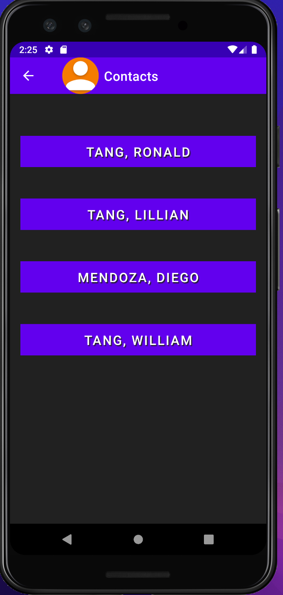
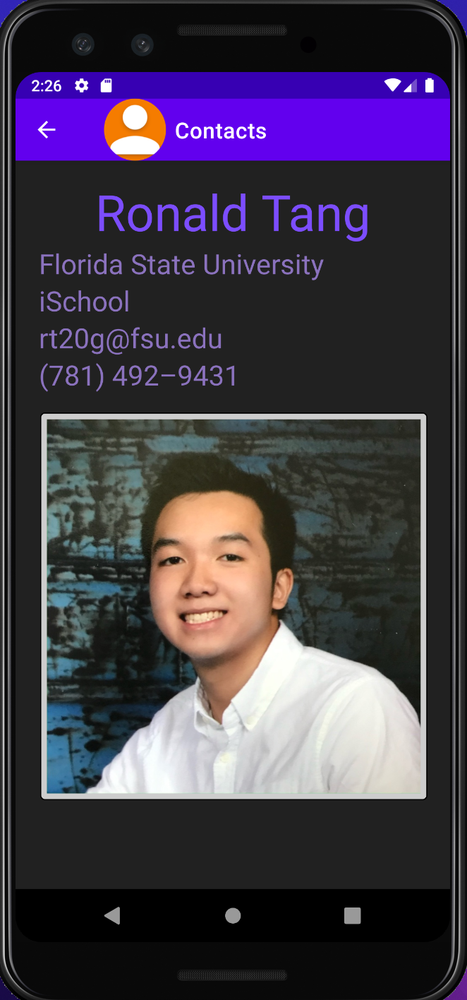
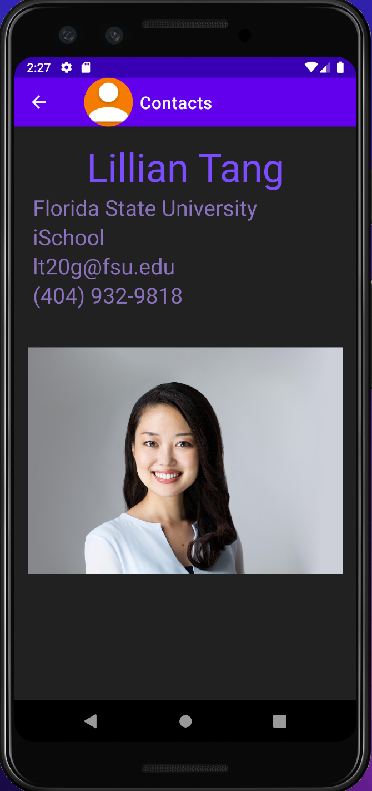
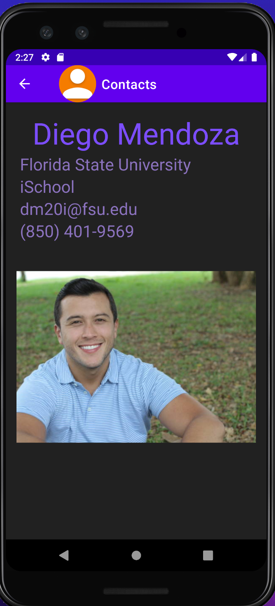

# LIS 4331 - Advanced Mobile Web Application Development

## Ronald Tang

### Assignment 1 Requirements:

*Three parts:*

1. Distributed Version Control with Git and Bitbucket
2. Development Installations
3. Chapter Questions (Chs 1,2)

#### README.md file should include the following items:

* Screenshot of running java Hello
* Screenshot of running Android Studio - My First App
* Git commands w/short descriptions
* Bitbucket repo links

> #### Git commands w/short descriptions:

1. git init - initializes a new repository
2. git status - displays the state of the working directory and the staging area
3. git add - adds a change in the working directory to the staging area
4. git commit - captures a snapshot of the project's currently staged changes
5. git push - uploads local repository content to a remote repository
6. git pull - updates the local version of a repository from a remote repository
7. git clone - creates a clone or copy of the existing repository into the targeted repository

#### Assignment Screenshots:

| Screenshot of running java Hello | Screenshot of Android Studio - My First App |
| ---------- | ---------- |
|  |  |

| Screenshot of Contacts Main Menu | Screenshot of Contacts Information: Ronald |
| ---------- | ---------- |
|  |  

| Screenshot of Contacts Information: Lillian | Screenshot of Contacts Information: Ronald |
| ---------- | ---------- |
|  |  

#### Tutorial Links:

*Bitbucket Tutorial - Station Locations:*
[A1 Bitbucket Station Locations Tutorial Link](https://bitbucket.org/ronaldtang1/bitbucketstationlocations/ "Bitbucket Station Locations")

*Remote repository:*
[My Remote Repository ](https://bitbucket.org/ronaldtang1/lis4331/ "My Remote Repository")