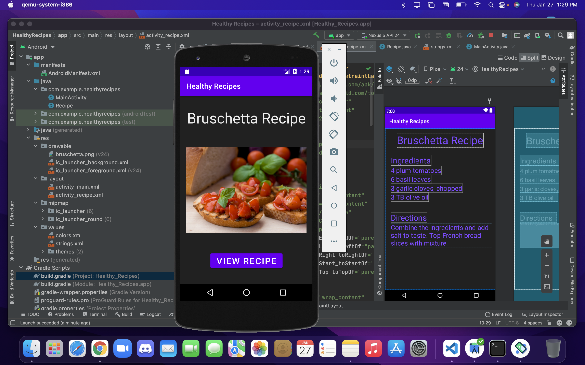
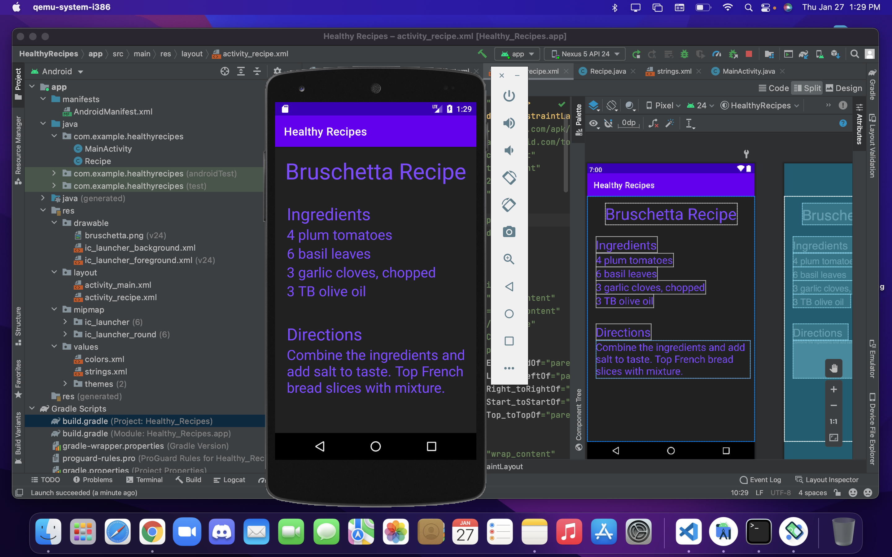
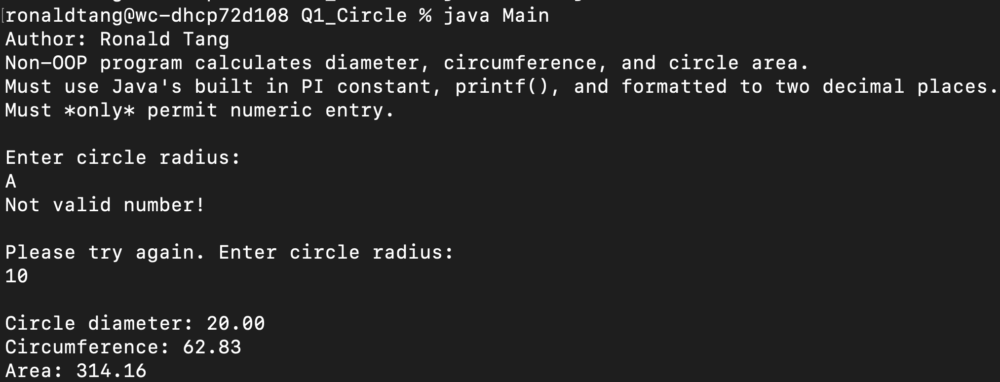
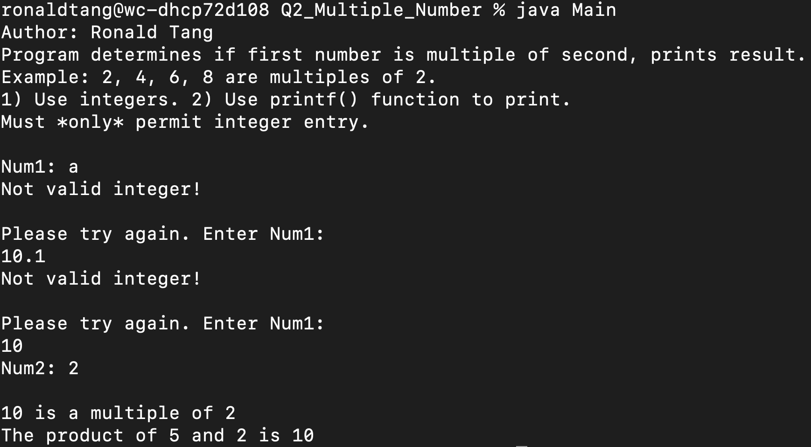
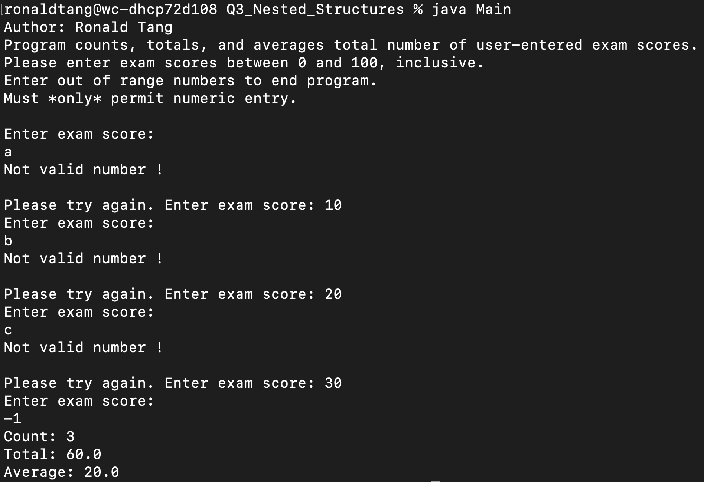

# LIS 4331 - Advanced Mobile Web Application Development

## Ronald Tang

### Assignment 2 Requirements:

*Five Parts:*

1. Created Tip Calculator App
2. Screenshots of it running
3. Screenshot of Skillset 1
4. Screenshot of Skillset 2
5. Screenshot of Skillset 3

#### README.md file should include the following items:

* Screenshot of running application’s unpopulated user interface
* Screenshot of running application’s populated user interface
* Screenshots of Skillsets
* Bitbucket repo link

#### Assignment Screenshots:

| Screenshot of Unpopulated User Interface running | Screenshot of Populated Interface running |
| ---------- | ---------- |
|  |  |

| Skillset 1 | Skillset 2 | Skillset 3 |
| ---------- | ---------- | ----------|
|  |  | 

#### Bitbucket Links:

*Remote repository:*
[My Remote Repository](https://bitbucket.org/ronaldtang1/lis4331/ "My Remote Repository")
