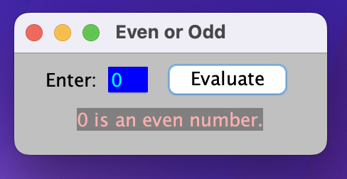
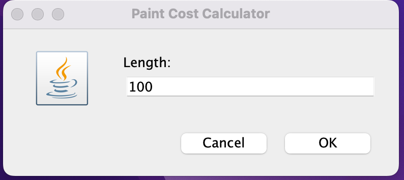
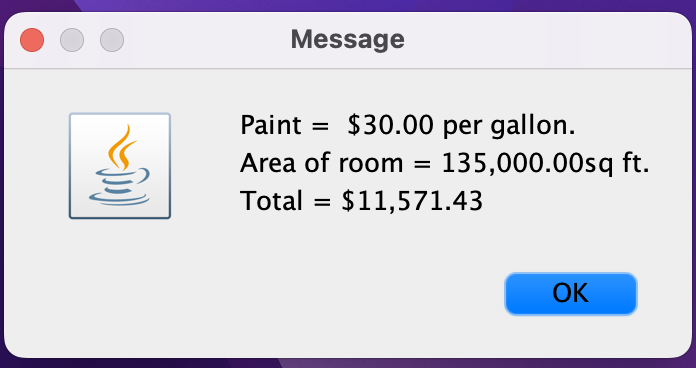

# LIS 4331 - Advanced Mobile Web Application Development

## Ronald Tang

### Assignment 3 Requirements:

*Five Parts:*

1. Created Converted Currency Calculator
2. Screenshots of running application's splash screen interface
3. Screenshots of running application's unpopulated user interface
4. Screenshots of running application's toast notification
5. Screenshots of running application's converted currency
6. Screenshots of skillsets

#### README.md file should include the following items:

* Screenshots of running application's splash screen interface
* Screenshots of running application's unpopulated user interface
* Screenshots of running application's toast notification
* Screenshots of running application's converted currency
* Screenshots of skillsets
* Bitbucket repo link

#### Assignment Screenshots:

| Screenshot of running splash screen interface | Screenshot of unpopulated user input |
| ---------- | ---------- |
|  |  |

| Screenshot of running toast notification | Screenshot of converted currency |
| ---------- | ---------- |
|  |  |

*Skillset 4*:

| Skillset 5 of No validation | Skillset 5 of Data validation |
| ---------- | ---------- |
|  |  |

| Skillset 6 of message popup | Data Validation 1 | Data Validation 2 |
| ---------- | ---------- | ---------- |
|  |  |  |

| Continued Screenshot of skillet 6 | Data Validation 4 | Data Validation 5 |
| ---------- | ---------- | ---------- |
|  |  |  |

#### Bitbucket Links:

*Remote repository:*
[My Remote Repository](https://bitbucket.org/ronaldtang1/lis4331/ "My Remote Repository")
