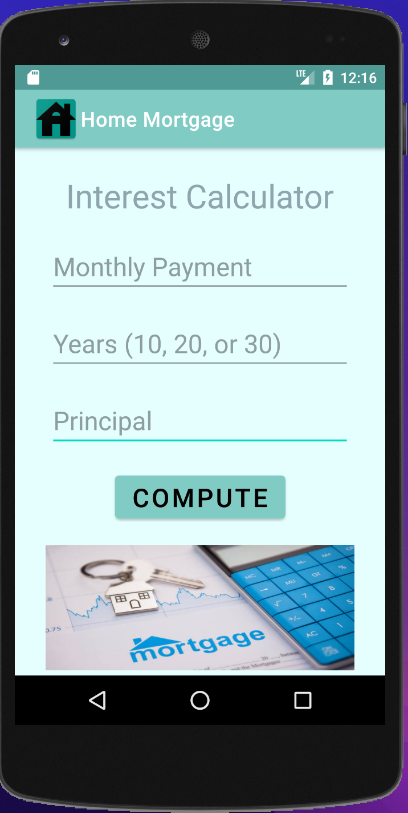

# LIS 4331 - Advanced Mobile Web Application Development

## Ronald Tang

### Assignment 4 Requirements:

*Five Parts:*

1. Include splash screen image (or, create your own), app title, intro text.
2. Include appropriate images.
3. Must use persistent datA: SharedPreferences.
4. Widgets and images must be vertically and horizontally alinged.
5. Must add background color(s) or theme.
6. Create and display launcher iron image.

#### README.md file should include the following items:

* Screenshot of running application's splash screen.
* Screenshot of running application's invalid screen (with appropriate image).
* Screenshots of running application's valid screen (with appropriate image).
* Screenshots of skillsets
* Bitbucket repo link

#### Assignment Screenshots:

| Gif of running app | Screenshot of Splash Screen |
| ---------- | ---------- | 
|  |  |

| Screenshot of Main Page | Screenshot of Validated Data  | Screenshot of Correct Input |
| ---------- | ---------- | ---------- |
|  |  |  |

| Skillset 10 | Skillset 11 | Skillset 12 |
| ---------- | ---------- | ---------- |
|  |  | 

#### Bitbucket Link:

*My Remote repository:*
[Remote repository](https://bitbucket.org/ronaldtang1/lis4331/ "Remote repository")
