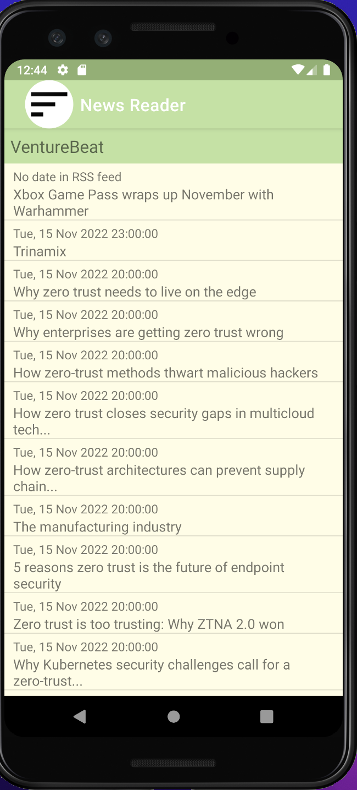
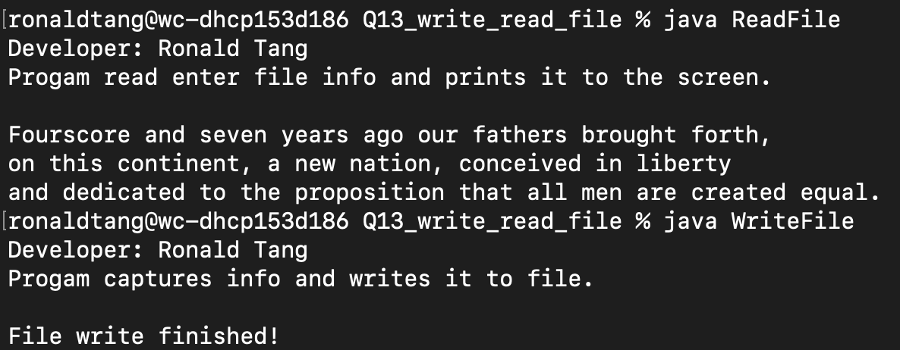
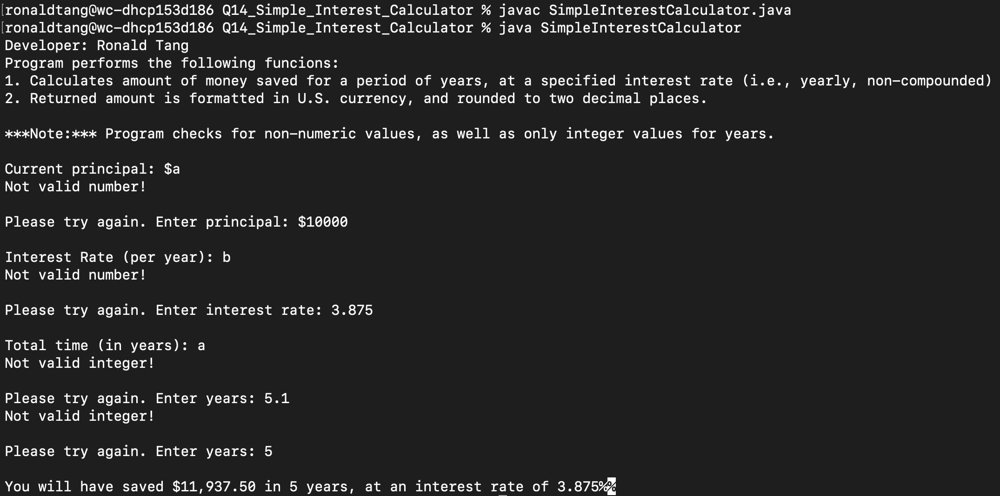
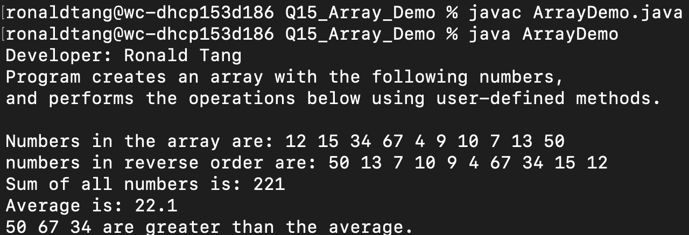

# LIS 4331 - Advanced Mobile Web Application Development

## Ronald Tang

### Assignment 5 Requirements:

*Five parts:*

1. Include splash screen (optional)
2. Main screen with app title and list of articles
3. Must find and use your own RSS feed
4. Must add background color(s) or theme
5. Create and display launcher icon image

#### README.md file should include the following items:

* Screenshot of running application's main screen (list of articles - activity_items.xml)
* Screenshot of running application's individual article (activity_item.xml)
* Screenshot of running application's default browser (article link)

#### Assignment Screenshots:

| Screenshot of Main Page | Screenshot of Individual Page  | Screenshot of Article Link |
| ---------- | ---------- | ---------- |
|  |  |  |

| Skillset 13 | Skillset 14 | Skillset 15 |
| ---------- | ---------- | ---------- |
|  |  | 

#### Bitbucket Link:

*My Remote repository:*
[Remote repository](https://bitbucket.org/ronaldtang1/lis4331/ "Remote repository")
