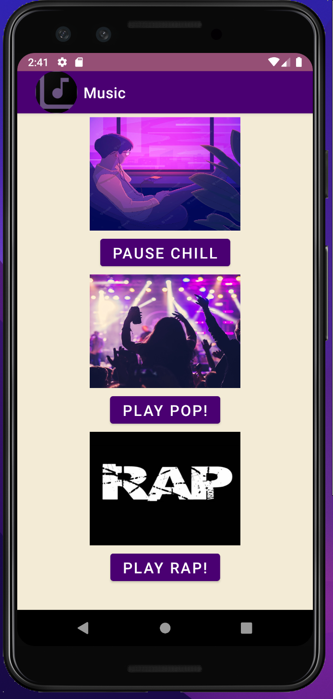

# LIS 4331 - Advanced Mobile Web Application Development

## Ronald Tang

### Project 1 Requirements:

*Four parts:*

1. Splash screen image, app title, intro text.
2. Include artists' images and media.
3. Images and buttons must be vertically and horizontally aligned.
4. Must add background color(s) or theme.
5. Create and display launcher icon image.

#### README.md file should include the following items:

* Course title, your name, assignment requirements, as per A1.
* Screenshot of running application's splash screen.
* Screenshot of running application's follow-up screen.
* Screenshot of running application's play and pause user interfaces.
* Bitbucket repo link

#### Assignment Screenshots:

| Screenshot of splash screen | Screenshot of play screen | Screenshot of pause screen
| ---------- | ---------- | ---------- |
|  |  | 

| Skillset 7 | Skillset 8 | Skillset 9 |
| ---------- | ---------- | ----------|
|  |  | 

#### Bitbucket Link:

*Remote repository:*
[Bitbucket Repository Link](https://bitbucket.org/ronaldtang1/lis4331/ "My bitbucket repo link")
