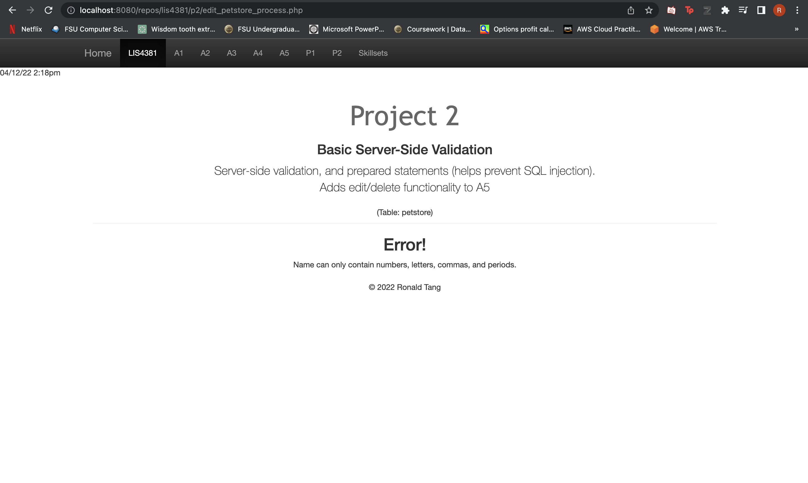
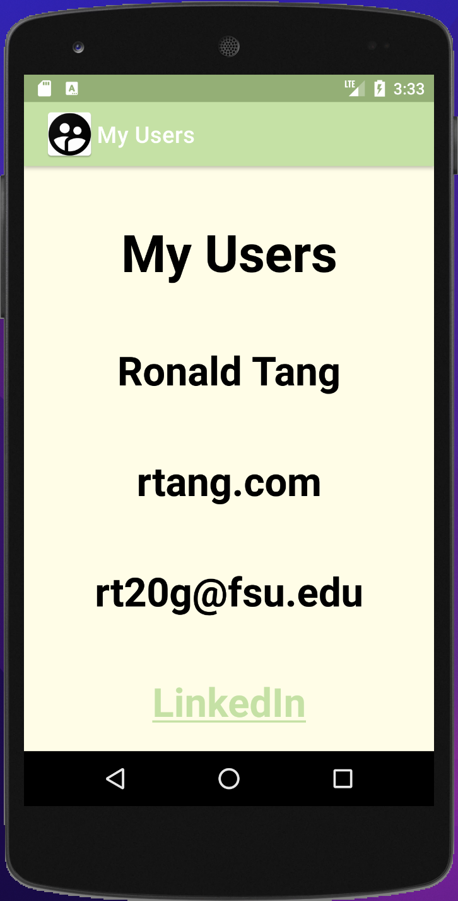
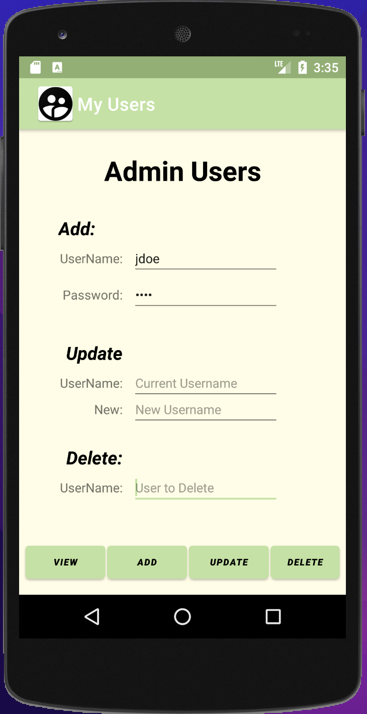
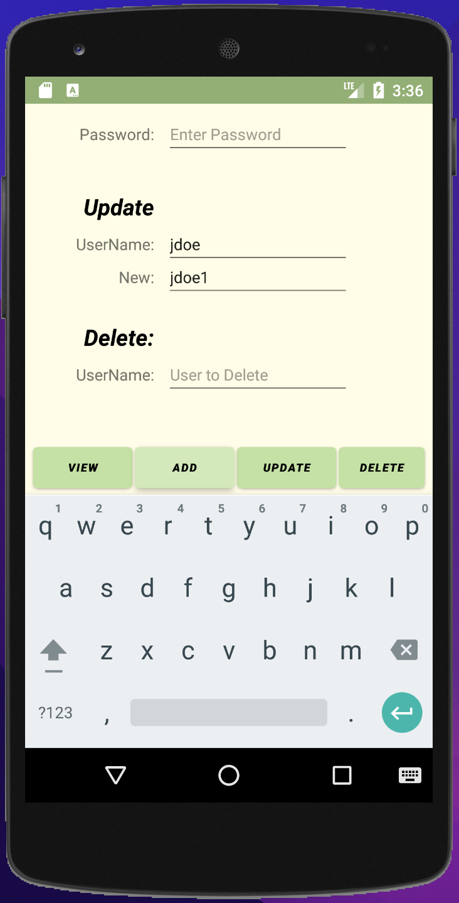
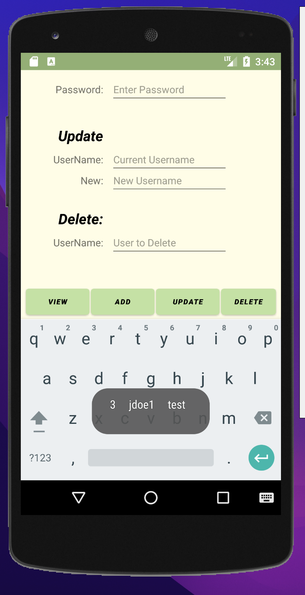
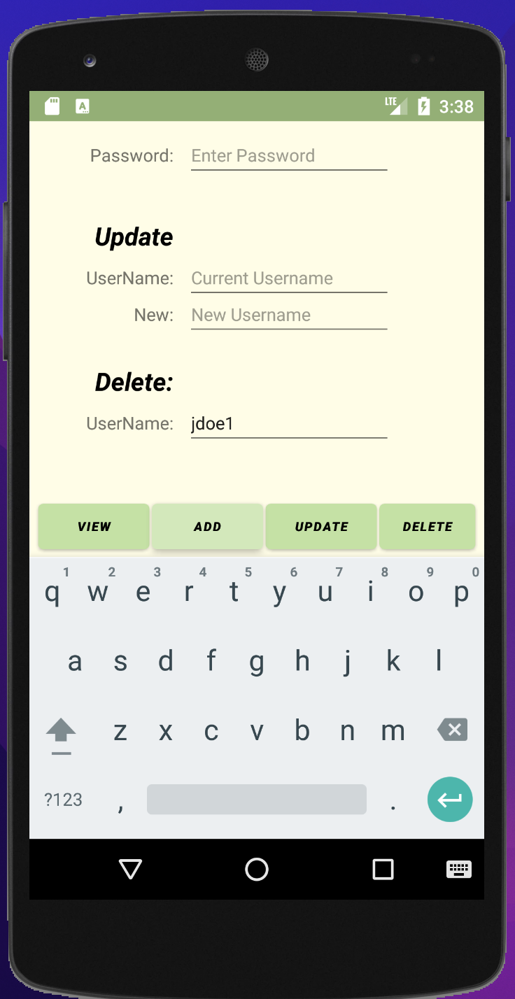

# LIS 4331 - Advanced Mobile Web Application Development

## Ronald Tang

### Project 2 Requirements:

*Four parts:*

1. Splash screen image, app title, intro text.
2. Must use persistent data: SQLite database.
3. Insert at least five users.
4. Must add background color(s) or theme.
5. Create and display launcher icon image.

#### README.md file should include the following items:

* Course title, your name, assignment requirements, as per A1.
* Screenshot of running application's splash screen.
* Screenshot of running application's Main screen.
* Screenshot of running application's add, update, and delete functions.

#### Assignment Screenshots:

| Gif of app | Splash Screen | Add User | 
| ---------- | ---------- | ---------- |
|  | |  | 

| Update User | View Users | Delete User |
| ---------- | ---------- | ---------- |
|  |  |  |

#### Bitbucket Link:

*My Remote repository:*
[Remote repository](https://bitbucket.org/ronaldtang1/lis4331/ "Remote repository")
